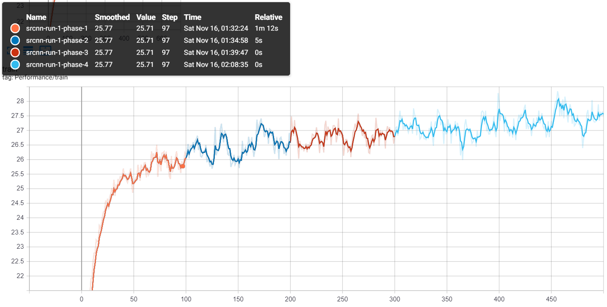

# Axium Crisis


Save entire experiment process while training deep learning models with
pytorch. This includes:

  * Random number generator states (random, numpy, pytorch)
  * How is the dataset loaded
  * Model parameters at significant epochs
  * Data written to TensorBoard

You may replay the experiment and fast-forward to an epoch at any time. For
example, run #1 includes epoch 1 to 100, run #2 began from epoch 91 in run #1,
run #3 began from epoch 151 in run #2 and so on. All of those runs share the
same curve, as the figure shows below (in TensorBoard):



The project is composed mainly of 6 units:

  * InoRI: Random number generator manager
  * HikarI: Experiment history writer
  * TairitsU: History reader and replay manager
  * ShirabE: Cache-based high performance dataset
  * KuroyuKI: Retroactive model trainer
  * train: A useful function that connects them all

By default, this project is set to optimize with L1 loss, evaluate PSNR and
gradient descent with Adam (b1 = 0.999, b2 = 0.9).

## Usage

If you used to write the code like this:

```python
model = WaifuModel((48, 48), channels=16, upsample=4)
```

Now, in Axium Crisis you can write the training code in this way:

```python
import axiumcrisis

model_args = (WaifuModel, [(48, 48)], dict(channels=16, upsample=4))
axiumcrisis.train(model_args, './dataset/', (48, 48), 4,
                  100, history='./run-10/', force_seed='pure-memory',
                  tb_log_path='../tensorboard/logs/10/')
```

Or recalling history:

```python
axiumcrisis.train(model_args, './dataset/', (48, 48), 4,
                  200, history='./run-11/', recall='./run-10/',
                  start_from_epoch=101, tb_log_path='../tensorboard/logs/11/')
```

Consult the code documentation for details on further usage.

## Installation

Copy the code to your working directory and it should work.

Remember to install requirements with:

```sh
pip install -r requirements.txt
```

You might have to [install pytorch](https://pytorch.org/get-started/locally/)
manually from the official website.

## Contribution

We are open to issues and pull requests for new features or bug fixes.
